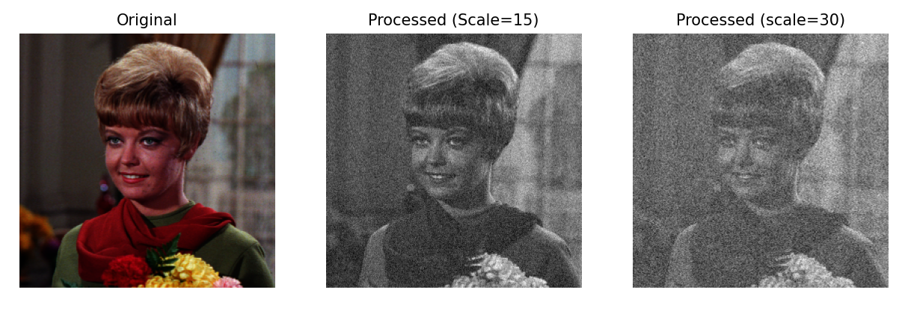
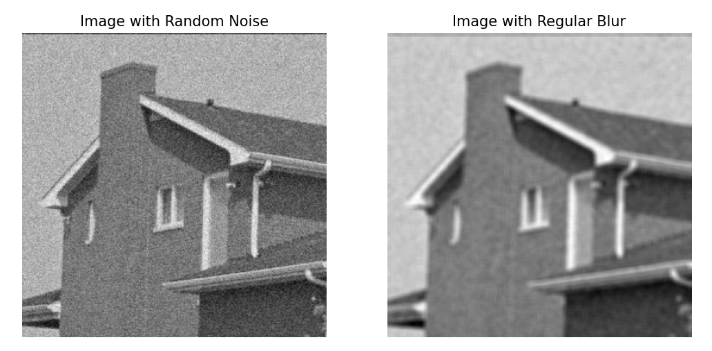
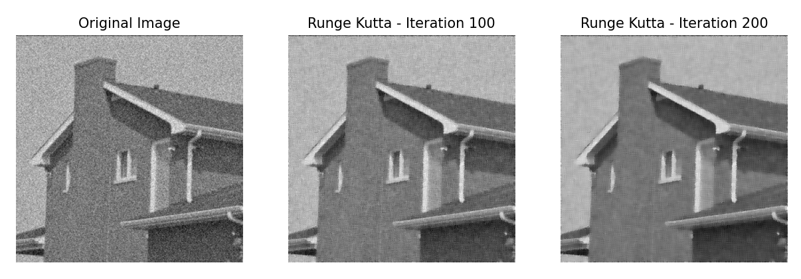
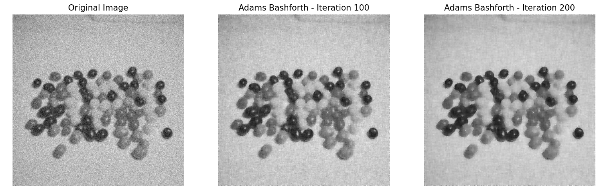
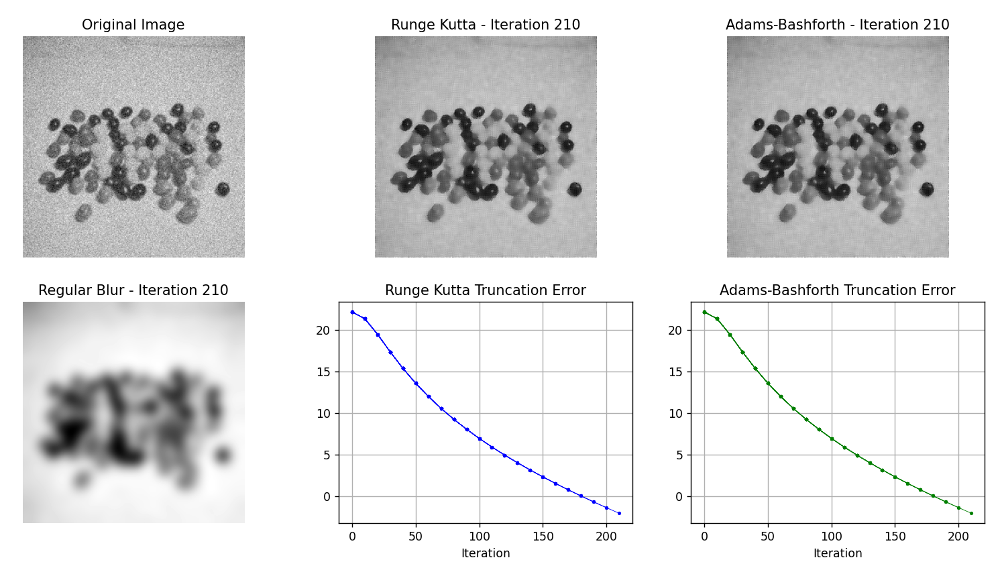
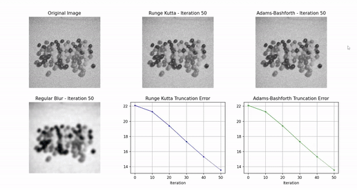

# Computational Project 2

## Overview
This project implements image denoising techniques using the Runge-Kutta and Adams-Bashforth methods, applied through the Perona-Malik diffusion process. The primary goal is to reduce noise in images while preserving essential details and edges.

## Functions

### `convert_to_grayscale(path)`
- **Purpose**: Converts an image to grayscale and scales it to 256x256 if larger.
- **Input**: `path` - Path to the image file.
- **Output**: Grayscale image as a numpy.ndarray.

### `add_noise(img, loc, scale)`
- **Purpose**: Adds random Gaussian noise to an image.
- **Input**: 
  - `img` - Input image as a numpy.ndarray.
  - `loc` - Mean of the Gaussian noise.
  - `scale` - Standard deviation of the Gaussian noise.
- **Output**: Noisy image as a numpy.ndarray.

### `plot_original_image(img, axs)`
- **Purpose**: Plots the original image on given axes.
- **Input**: 
  - `img` - Image to plot.
  - `axs` - Matplotlib axes to plot the image on.

### `regular_blur(img, kernel_size, sigma)`
- **Purpose**: Applies Gaussian blur to an image.
- **Input**: 
  - `img` - Input image.
  - `kernel_size` - Size of the Gaussian kernel.
  - `sigma` - Standard deviation of the Gaussian kernel.
- **Output**: Blurred image.

### `rungeKutta_method(img, k, lambda_, h)`
- **Purpose**: Applies the Runge-Kutta numerical integration method for Perona-Malik diffusion.
- **Input**: 
  - `img` - Input image.
  - `k` - Diffusion coefficient.
  - `lambda_` - Edge enhancement parameter.
  - `h` - Time step size.
- **Output**: Processed image.

### `adamsBashforth_method(img, prev_derivative, k, lambda_, h)`
- **Purpose**: Applies the Adams-Bashforth method for image processing using Perona-Malik diffusion.
- **Input**: 
  - `img` - Input image.
  - `prev_derivative` - Derivative of the previous image.
  - `k`, `lambda_`, `h` - Diffusion coefficient, edge enhancement parameter, and time step size, respectively.
- **Output**: Tuple containing the updated image and the current derivative.

### `perona_malik_diffusion(img, k, lambda_)`
- **Purpose**: Applies Perona-Malik diffusion to an image.
- **Input**: 
  - `img` - Input image.
  - `k` - Diffusion coefficient.
  - `lambda_` - Time step.
- **Output**: Diffused image.

### `plot_images(noisyimg, grayimg, k, lambda_, h, iterations)`
- **Purpose**: Plots a series of images and their truncation errors during an iterative process.
- **Input**: 
  - `noisyimg` - Original noisy image.
  - `grayimg` - Grayscale version of the original image.
  - `k`, `lambda_`, `h`, `iterations` - Diffusion coefficient, edge enhancement parameter, time step size, and number of iterations, respectively.

## Usage
The project can be used to demonstrate the effectiveness of numerical methods in reducing noise in images. Example usage is provided in the script, demonstrating the application of both the Runge-Kutta and Adams-Bashforth methods on an input image.

## Results

The image above shows the result of the `convert_to_grayscale` and `add_noise` function. As you can see, the image has been converted to grayscale and random Gaussian noise has been added. The `scale` argument in the `np.random.normal` function controls the amount of noise. A larger `scale` value results in a noisier image, while a smaller `scale` value results in a less noisy image.

The image above shows the result of applying a Gaussian blur to the noisy image using the `regular_blur` function. It applies a Gaussian blur to the image by convolving the image with a Gaussian kernel. The `sigma` parameter controls the standard deviation of the Gaussian distribution used for the kernel, which affects the intensity of the blurring. A larger `sigma` value results in more blurring, while a smaller `sigma` value results in less blurring. 

As you can see, the Gaussian blur smooths the image by reducing the intensity of the noise. However, it also blurs the edges in the image, reducing the overall sharpness and detail. This side-by-side comparison demonstrates the trade-off between noise reduction and preserving image detail when using a Gaussian blur.

The `rungeKutta_method` function is used to apply the Runge-Kutta method for numerical integration on the Perona-Malik diffusion. The Perona-Malik diffusion is a type of anisotropic diffusion that helps in denoising the image while preserving the edges. The `rungeKutta_method` function takes in the noisy image, the diffusion coefficient `k`, the edge enhancement parameter `lambda_`, and the step size `h` for numerical integration.

The function works by first calculating the Perona-Malik diffusion of the image and multiplying it by the step size `h`. This is done four times, each time updating the image by adding a fraction of the previously calculated diffusion. The fractions are 0.5 for the second and third calculations and 1 for the fourth. The results of these four calculations are then combined in a weighted sum, with weights 1/6 for the first and last calculations and 2/6 for the second and third. This weighted sum is then added to the original image to get the denoised image.

The `k` parameter controls the diffusion coefficient, which affects the amount of smoothing. A larger `k` value results in more smoothing, while a smaller `k` value results in less smoothing. The `lambda_` parameter controls the edge enhancement, with a larger `lambda_` value resulting in more edge enhancement. The `h` parameter controls the step size for the numerical integration, with a smaller `h` value resulting in a more accurate approximation.

This method effectively reduces the noise in the image while preserving the edges, resulting in a denoised image that retains the important features of the original image.

The `adamsBashforth_method` function is also used for denoising the image. It uses the Adams-Bashforth method, another numerical integration technique. Like the Runge-Kutta method, it takes in the noisy image, the diffusion coefficient `k`, the edge enhancement parameter `lambda_`, and the step size `h`. However, it calculates the Perona-Malik diffusion only twice and uses a different weighted sum for updating the image. The `k`, `lambda_`, and `h` parameters have the same effects as in the Runge-Kutta method.

## Truncation Error and Stability

The stability of a method refers to its ability to produce a reasonable output for a range of inputs. The truncation error is the error made by truncating an infinite sum and approximating it by a finite sum.

For both the Runge-Kutta and Adams-Bashforth methods, the truncation error is of order `h^p`, where `h` is the step size and `p` is the order of the method. The Runge-Kutta method used here is of order 4, while the Adams-Bashforth method is of order 2. This means that when the step size is halved, the truncation error for the Runge-Kutta method is reduced by a factor of 16, while for the Adams-Bashforth method it is reduced by a factor of 4.

The stability and truncation error are plotted on a graph for visual comparison. The x-axis represents iteration size, and the y-axis represents the error. The plot shows that as the step size decreases, the error also decreases, confirming the order of the methods. However, if the step size is too small, the methods may become unstable, leading to an increase in error. This demonstrates the trade-off between accuracy and stability in numerical methods.

## Conclusion
The project successfully demonstrates the application of numerical methods in image denoising.

